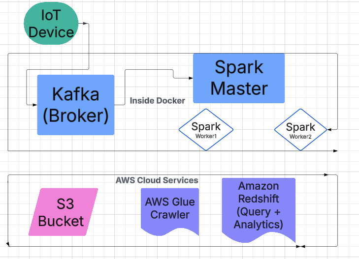

# Overview
This project demonstrates a near real-time data pipeline using Apache Kafka, Apache Spark (PySpark), and AWS (S3, Glue, Redshift). The pipeline is containerized with Docker, making it straightforward to deploy and manage.

## Key Highlights:
Data Generation: A Python script (main.py) simulates IoT sensor data coming from trucks in real-time.
Data Ingestion: The simulated data is sent to a Kafka topic.
Streaming Processing: Spark (running on Docker containers) processes the incoming messages.
Data Storage: Transformed data is saved as Parquet files in Amazon S3.
Catalog and Query: AWS Glue crawls the Parquet data to build a Data Catalog, and Amazon Redshift (or Redshift Spectrum) is used for querying and analytics

## Below is a high-level overview of how all the components interact.
 Notice that Kafka and Spark are containerized using Docker. The IoT device is simulated by a Python script (main.py), but in a real-world scenario, it would be an actual hardware device sending data over the network.

Data Generation: main.py simulates IoT data (e.g., temperature, GPS coordinates, speed).
Kafka (Docker): Receives the streaming data.
Spark (Docker): Spark Master + Spark Workers read from Kafka, transform data, and write Parquet files to S3.
S3: Stores the Parquet files.
AWS Glue: Crawls S3 to discover schemas and update the AWS Glue Data Catalog.
Amazon Redshift: Queries and analyzes the data using the Glue Data Catalog.

## Technology Stack
Docker
Containerizes Kafka, Spark Master, and Spark Workers.
Simplifies deployment and scaling.
Apache Kafka
Real-time ingestion of streaming IoT data.
Apache Spark (PySpark)
Distributed data processing in near real-time.
One Spark Master and multiple Worker nodes.
Amazon S3
Stores processed data in Parquet format.
AWS Glue
Automatically discovers schema and creates/updates the Data Catalog.
Amazon Redshift
Performs complex queries and analytics on the data.

## Setup and Installation
git clone https://github.com/your-username/your-repo.git
cd your-repo

## Install Dependencies
pip install -r requirements.txt

## Environment Variables (Optional)
Create a .env file to store AWS or Kafka configurations if you plan to connect to external services:
AWS_ACCESS_KEY_ID=YOUR_AWS_KEY
AWS_SECRET_ACCESS_KEY=YOUR_AWS_SECRET
AWS_DEFAULT_REGION=us-east-1

## Start Services (Local Dev)
docker-compose up -d

## Generate IoT Data (main.py)
Run the main.py script to simulate IoT data (e.g., temperature, speed, GPS):
python scripts/main.py

Once Kafka is receiving data, submit the Spark streaming job